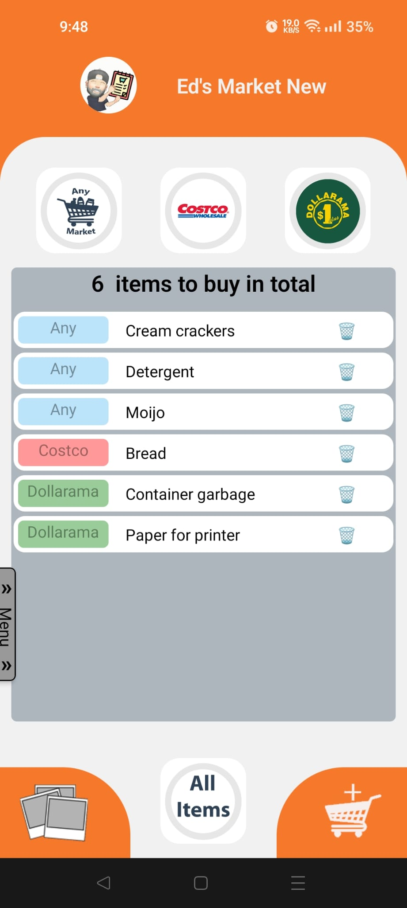
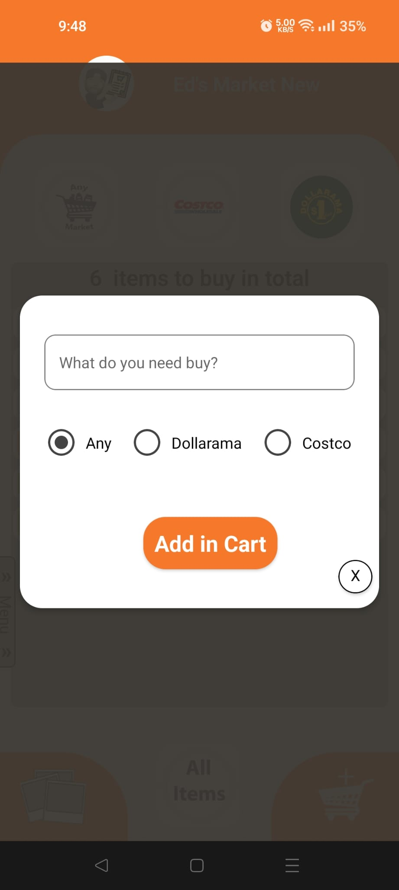
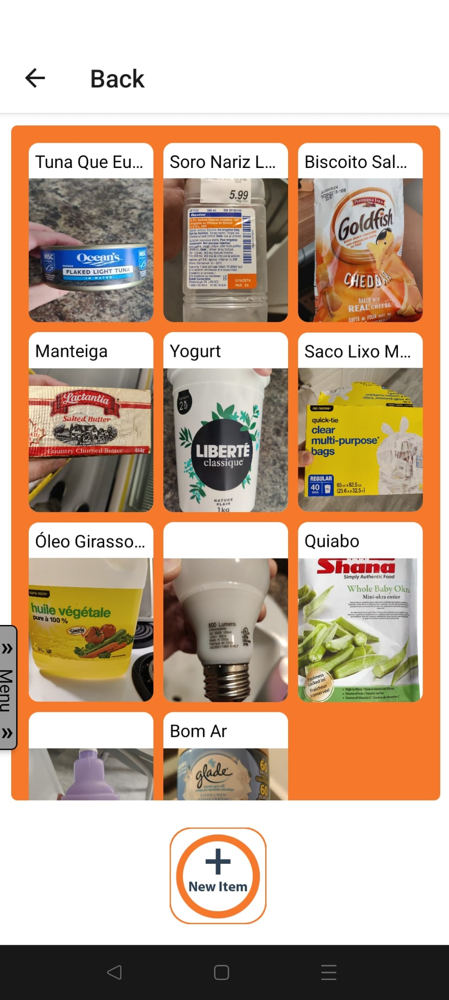
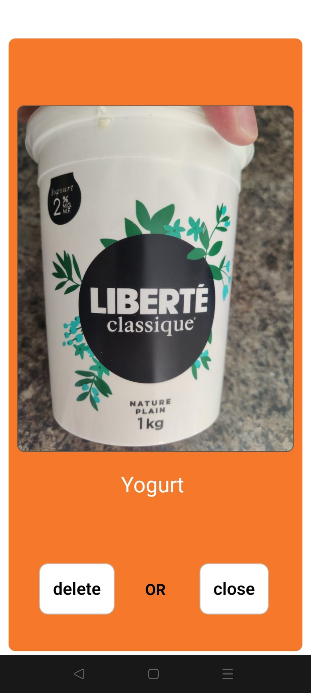
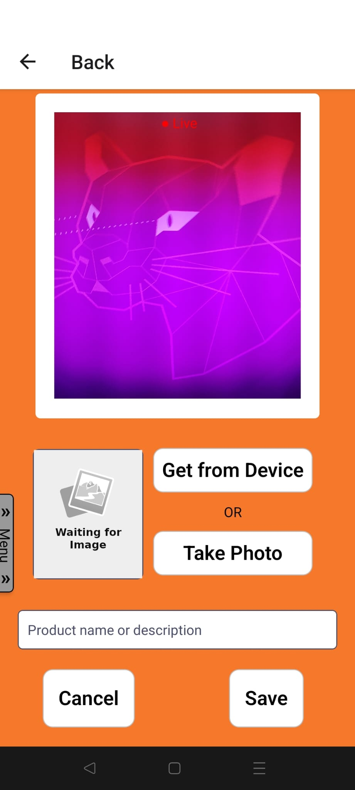
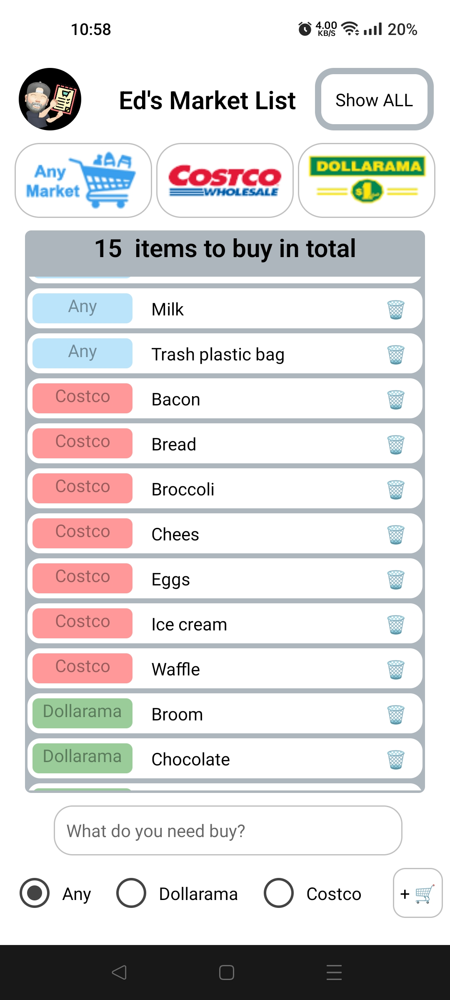
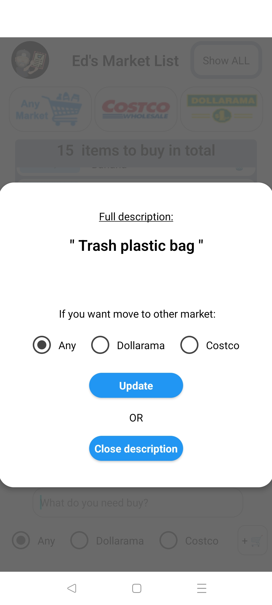
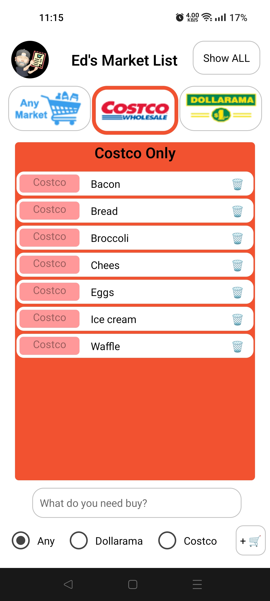
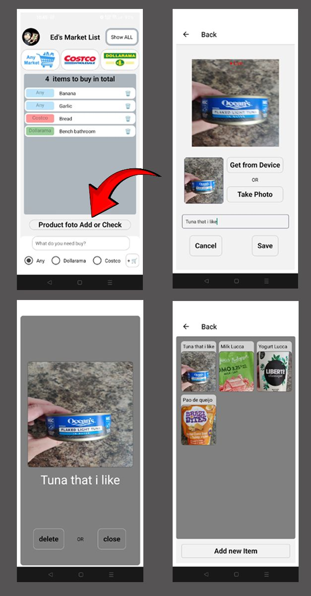

# Ed's Market

<h4> Its basically a ToDo List , but supercharged, using Supabase as a Database to store the tasks, so my wife and I can update the list in real time, editing it on my Android or her IOS.</h4>

## New Layout

 &emsp; &emsp; &emsp; &emsp; 

# Old Layout

<h4>Logo &emsp; &emsp; &emsp; &emsp; &emsp; &emsp; &emsp; &emsp; &emsp; &emsp; &emsp; &emsp; Full View</h4>

 &emsp; 

<h4>Single Market &emsp; &emsp; &emsp; &emsp;&emsp; &emsp; &emsp; &emsp; &emsp; Click on Item</h4>

 &emsp; 

<h3> NEW UPDATE 06-Oct-23</h3>

<h4>Now when you want to remember a product to buy later, you can take a photo or choose a photo that was sent to you. This helps me a lot to remember what the product was in the supermarket.</h4>

