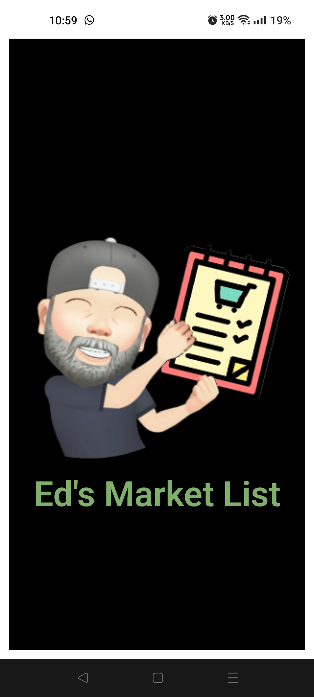

# Ed's Market

### Its basically a ToDo List , but supercharged, using Supabase as a Database to store the tasks, so my wife and I can update the list in real time, editing it on my Android or her IOS.

#### Logo &emsp; &emsp; &emsp; &emsp; &emsp; &emsp; &emsp; &emsp; &emsp; &emsp; &emsp; &emsp; Full View

 &emsp; 

#### Single Market &emsp; &emsp; &emsp; &emsp;&emsp; &emsp; &emsp; &emsp; &emsp; Click on Item

 &emsp; 

### NEW UPDATE 06-Oct-23

#### Now when you want to remember a product to buy later, you can take a photo or choose a photo that was sent to you. This helps me a lot to remember what the product was in the supermarket.

